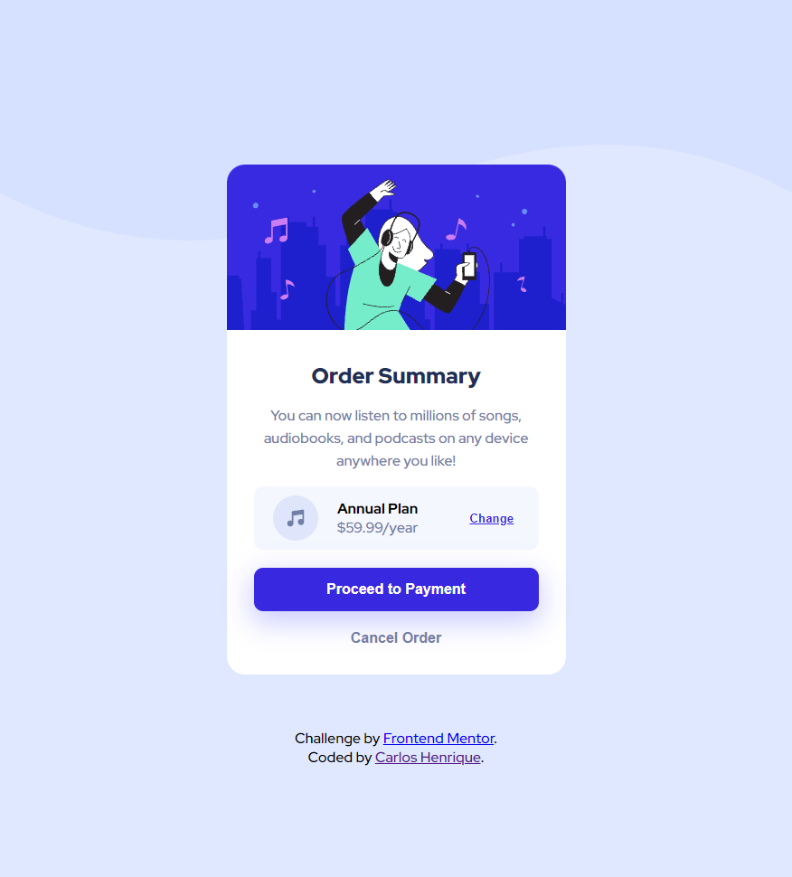

# Frontend Mentor - Order summary card solution

This is a solution to the [Order summary card challenge on Frontend Mentor](https://www.frontendmentor.io/challenges/order-summary-component-QlPmajDUj).

## Table of contents

- [Overview](#overview)
  - [Screenshot](#screenshot)
  - [Links](#links)
- [My process](#my-process)
  - [Built with](#built-with)
  - [What I learned](#what-i-learned)
  - [Continued development](#continued-development)
  - [Useful resources](#useful-resources)
- [Author](#author)

## Overview

The goal of this challenge was to create a order summary card using. Althogh the challenge allows to use any tool, I decided to challenge my self and use only pure HTML and CSS to see how are my skills since it's been since I've only been using Vue/React and SASS.

### Screenshot



### Links

- Solution URL: [Add solution URL here](https://your-solution-url.com)
- Live Site URL: [Add live site URL here](https://your-live-site-url.com)

## My process

I started by reading all the challenge description. When I understood what was needed to be done, I started by writing the html and adding classes to the elemens.
Once I was satisfied with the HTML structure, I linked the css stylesheet and started with some basic styling mostly using "display" property to set the elements in the right position. Then I added the colors and sizes. And, for the last part I added the custom styles for the interactive elements.

### Built with

- Pure HTML5 markup;
- Pure CSS

### What I learned

This challenge helped me to remember how to define variables in css. An example of it is below:

```css
  :root {
    --pale-blue: hsl(225, 100%, 94%);
  }

  .card {
    background-color: var(--pale-blue);
  }
```

### Continued development

I want to keep learning and improve my HTML skills to write it with better semantic to improve SEO.
And i also want to keep improving my css skills

### Useful resources

- [How can I define colors as variables in CSS?](https://stackoverflow.com/questions/1875852/how-can-i-define-colors-as-variables-in-css) - This helped me to remember how to set variables in css and define variables for the colors I used in the challenge.

## Author

- Website - [Carlos Henrique](https://www.carloshenrique.dev)
- Frontend Mentor - [@henriqueok20](https://www.frontendmentor.io/profile/henriqueok20)
- Twitter - [@Hen__riqe](https://twitter.com/Hen_riqe)
